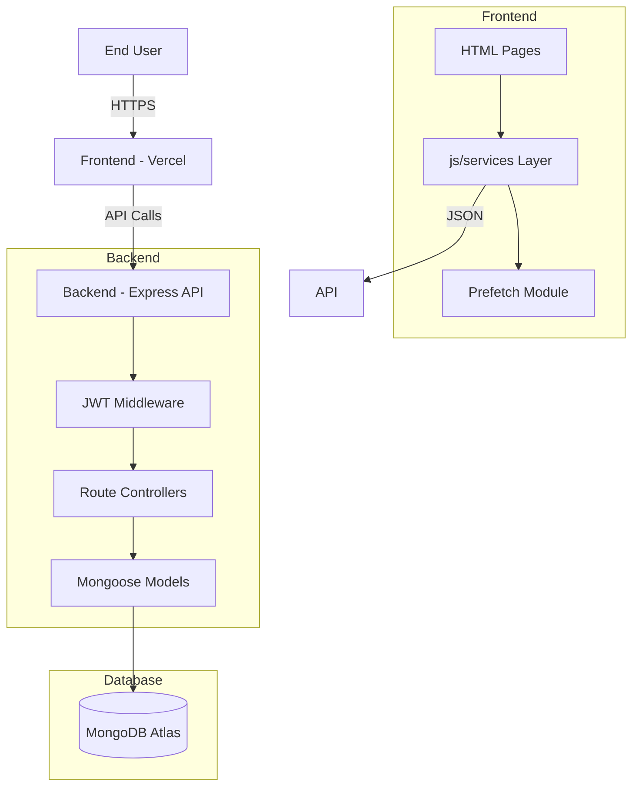

# 🏗 System Architecture: SwasthyaSetu


---

## 1. High-Level Overview

SwasthyaSetu is a unified digital health platform designed to serve three primary user groups:

- **Patients**
- **Hospitals**
- **Government Authorities**

The system enables appointment booking, digital health record management, hospital resource monitoring, and national-level public health analytics.

The platform follows a **Client–Server Architecture**:

- **Frontend:** Vanilla HTML/CSS/JavaScript with modular service-based structure
- **Backend:** RESTful API built with Node.js and Express
- **Database:** MongoDB Atlas
- **Infrastructure:** Vercel (Frontend) + Render (Backend)

---

## 2. Technical Stack

### Frontend

- HTML5, CSS3, JavaScript (ES6+)
- Tailwind CSS (CDN)
- Chart.js (Analytics & visualization)
- Leaflet.js (Map-based visualizations)
- Modular JS architecture (`js/services/`, `js/pages/`)
- Prefetch layer for performance optimization

### Backend

- Node.js
- Express.js
- MongoDB with Mongoose ODM
- JWT-based authentication
- bcryptjs (Password hashing)
- Helmet, CORS, Rate Limiting
- Compression middleware

### Database (MongoDB Atlas)

Core Collections:

- `users`
- `appointments`
- `hospitals`
- `medicalrecords`
- `healthalerts`
- `publichealthlogs`

---

## 3. Data Flow Architecture



---
## 4. Core Architectural Components

### 4.1 Authentication & Security

- Stateless authentication using JWT
- Password hashing using bcrypt
- Role-Based Access Control (RBAC)
- Secure API endpoints protected via middleware

Authentication Flow:

1. User submits login credentials
2. Backend validates credentials and returns JWT
3. Frontend stores token securely
4. Subsequent requests include the Authorization header

Example header:

```text
Authorization: Bearer <token>
```

---

### 4.2 Frontend Architecture

The frontend follows a modular service-based structure.

Key directories:

- `js/services/` – API communication and business logic
- `js/pages/` – Page-specific logic
- `js/utils/` – Shared utilities
- `components/` – Reusable UI elements

Core services:

- `api.js` – Base HTTP client with environment detection
- `auth.js` – Authentication handling
- `prefetch.js` – Post-login background data loader
- `location.js` – Geolocation service

Frontend design principles:

- Vanilla JS modular structure
- Service-layer abstraction
- Background prefetch after login
- Defensive error handling
- Local caching for performance

---

### 4.3 Backend API Structure

RESTful API organized by resource.

Primary route groups:

- `/api/auth` – Authentication routes
- `/api/appointments` – Appointment management
- `/api/hospitals` – Hospital data
- `/api/profile` – User profile operations
- `/api/health` – Alerts and public health data
- `/api/analytics` – Government dashboard data

Backend architecture layers:

- Routes → Controllers → Models → Database

Database access via Mongoose models with:

- Indexed fields for performance
- `.lean()` queries for read-only operations
- Parallel population for relational data

---

## 5. Data Flow Architecture

User Request Flow:

1. User interacts with frontend interface
2. Frontend service layer sends API request
3. Backend validates JWT (if protected route)
4. Controller processes request
5. Mongoose queries MongoDB
6. Response returned as JSON
7. Frontend updates UI

System Components:

- Client Browser (Frontend)
- Express API Server (Backend)
- MongoDB Atlas (Database)
- External APIs (COVID data, maps, etc.)

This layered architecture ensures:

- Clear separation of concerns
- Maintainability
- Scalable API structure
- Performance optimization support
---
## 6. Performance Optimization Strategy

The system incorporates multiple optimization techniques across frontend and backend layers to ensure smooth performance during real-world usage and hackathon demonstrations.

### 6.1 Backend Optimizations

- Reduced bcrypt salt rounds (demo configuration) to improve login speed
- Parallel `.populate()` calls to minimize sequential database queries
- Use of `.lean()` for read-only queries to reduce Mongoose overhead
- Indexed frequently queried fields such as:
  - `abhaId`
  - `mobile`
  - `userId`
  - `hospitalId`
- Selective middleware usage to avoid unnecessary processing overhead

### 6.2 Frontend Optimizations

- Post-login data prefetching to enable instant dashboard rendering
- `Promise.allSettled()` used for resilient background fetching
- Six-hour caching for external public health API data
- Defensive `JSON.parse()` with corruption handling
- localStorage quota protection via try/catch
- Deferred script loading to prevent render blocking
- Geolocation timeout reduction with fallback strategy

### 6.3 Caching Strategy

Government dashboard:

- Public health API responses cached in localStorage
- Timestamp-based expiration (6 hours)
- Automatic invalidation on corruption

Prefetch service:

- In-memory cache
- Timestamp validation
- Partial success handling
- Cache cleared on logout

Performance Outcomes:

- Login time reduced significantly
- Dashboard renders instantly after login
- Government analytics load time improved
- Reduced blocking behavior during page initialization

---

## 7. Deployment Architecture

SwasthyaSetu supports a decoupled deployment model with independent frontend and backend hosting.

### 7.1 Frontend Deployment

- Hosted on Vercel
- Static HTML, CSS, and JavaScript
- CDN-based global distribution
- API requests proxied via rewrite rules

Build configuration:

- No build step required
- Output directory set to project root
- Automatic deployment on push to main branch

### 7.2 Backend Deployment

- Hosted on Render
- Node.js runtime environment
- Express.js server
- Persistent MongoDB Atlas connection

Environment variables:

- `MONGODB_URI`
- `JWT_SECRET`
- `NODE_ENV`
- `PORT`

Features:

- Automatic redeploy on GitHub push
- Free-tier hosting support
- Health check endpoint for monitoring

### 7.3 Database Infrastructure

- MongoDB Atlas (cloud hosted)
- Free-tier cluster
- Secure connection via connection string
- IP whitelist configuration
- Indexed collections for performance

This deployment model ensures:

- Separation of frontend and backend concerns
- Scalability for future upgrades
- Cost-effective hosting
- Production-ready structure

---
## 8. Scalability Considerations

The architecture of SwasthyaSetu is designed to support future growth and modular expansion without requiring major refactoring.

### 8.1 Backend Scalability

- Modular route structure allows separation into microservices if required
- Controllers are isolated by domain (auth, appointments, analytics, etc.)
- Database indexing strategy supports large dataset queries
- Read-heavy endpoints can be optimized further using caching layers (e.g., Redis)
- Stateless JWT authentication enables horizontal scaling

### 8.2 Database Scalability

- MongoDB Atlas supports cluster scaling
- Collections structured to minimize deep relational joins
- Frequently queried fields indexed
- Aggregation pipelines can support large-scale analytics

### 8.3 Frontend Scalability

- Modular service-layer design allows easy feature expansion
- Prefetch and caching layers reduce repeated server load
- Pages separated by responsibility (government, hospital, patient)
- Future migration to full SPA framework possible without backend rewrite

### 8.4 Future Enhancements

- Redis-based caching layer
- WebSocket integration for real-time updates
- Background job queue for analytics processing
- Role-based audit logging system
- Multi-region deployment support

The system is structured to evolve from hackathon prototype to production-grade platform.

---

## 9. Design Philosophy

SwasthyaSetu is built with a performance-first and modular design mindset.

Core principles:

- Clear separation of concerns
- Service-layer abstraction on frontend
- RESTful backend architecture
- Secure-by-default authentication model
- Defensive programming to prevent runtime crashes
- Minimal external dependencies for maintainability
- Cost-efficient cloud deployment

The design prioritizes:

- Reliability under partial failure
- Fast user experience
- Maintainable code structure
- Expandability for future healthcare integrations

This philosophy ensures that SwasthyaSetu remains stable, scalable, and adaptable as system complexity grows.
---
